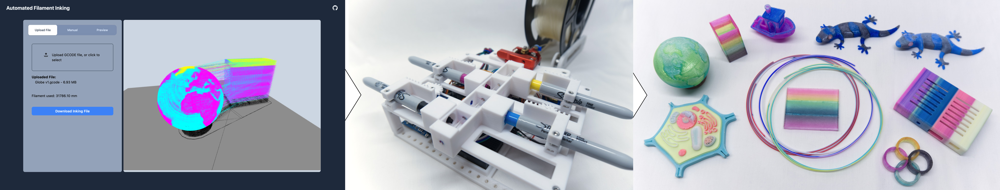

## Automated Filament Inking



We propose a novel system for low-cost multi-color Fused Filament Fabrication (FFF) 3D printing, allowing for the creation of customizable colored filament using a pre-processing approach. We developed an open-source device to automatically ink filament using permanent markers. Our device can be built using 3D printed parts and off-the-shelf electronics. An accompanying web-based interface allows users to view GCODE toolpaths for a multi-color print and quickly generate filament color profiles. Taking a pre-processing approach makes this system compatible with the majority of desktop 3D printers on the market, as the processed filament behaves no differently from conventional filaments. Furthermore, inked filaments can be produced economically, reducing the need for excessive purchasing of material to expand color options. We demonstrate the efficacy of our system by fabricating monochromatic objects, objects with gradient colors, objects with bi-directional properties, as well as multi-color objects with up to four colors in a single print.

Our github repository hosts the files necessary to 3D print and assemble the automated filament inking device, as well as the web interface for generating inking files (files interpretable by the inking device). These can be found in the "Device Files" folder. Editable files (.step) will be added shortly.

For more details of this approach, please refer to [our paper](https://cs.dartmouth.edu/~wjarosz/publications/littler22automated.pdf).

## Running the Web Interface

Install node modules:

```bash
cd Web\ Interface\
npm install
# or
yarn add
```

Run the development server:

```bash
npm run dev
# or
yarn dev
```

Open [http://localhost:3000](http://localhost:3000) with your browser to use the interface.

## Bill of Materials (BOM)

Coming soon!

## Assembly Guide

Coming soon!

## Project Page

See our [project page](https://dartgo.org/color-fff) for more details.

## Acknowledgements

This work was partially supported by NSF award** **[1844538](https://www.nsf.gov/awardsearch/showAward?AWD_ID=1844538&HistoricalAwards=false).

## Cite

Eammon Littler, **[Bo Zhu](https://cs.dartmouth.edu/~bozhu/),****[Wojciech Jarosz](https://www.cs.dartmouth.edu/~wjarosz/). Automated filament inking for multi-color FFF 3D printing.***ACM Symposium on User Interface Software and Technology (UIST)* , October 2022.

```
@inproceedings{littler22automated,
    author = "Littler, Eammon and Zhu, Bo and Jarosz, Wojciech",
    title = "Automated Filament Inking for Multi-color {FFF} {3D} Printing",
    booktitle = "ACM Symposium on User Interface Software and Technology (UIST)",
    year = "2022",
    month = oct,
    doi = "10/jjp9",
    keywords = "digital fabrication, rapid prototyping",
    abstract = "We propose a novel system for low-cost multi-color Fused Filament Fabrication (FFF) 3D printing, allowing for the creation of customizable colored filament using a pre-processing approach. We developed an open-source device to automatically ink filament using permanent markers. Our device can be built using 3D printed parts and off-the-shelf electronics. An accompanying web-based interface allows users to view GCODE toolpaths for a multi-color print and quickly generate filament color profiles. Taking a pre-processing approach makes this system compatible with the majority of desktop 3D printers on the market, as the processed filament behaves no differently from conventional filaments. Furthermore, inked filaments can be produced economically, reducing the need for excessive purchasing of material to expand color options. We demonstrate the efficacy of our system by fabricating monochromatic objects, objects with gradient colors, objects with bi-directional properties, as well as multi-color objects with up to four colors in a single print."
}
```
